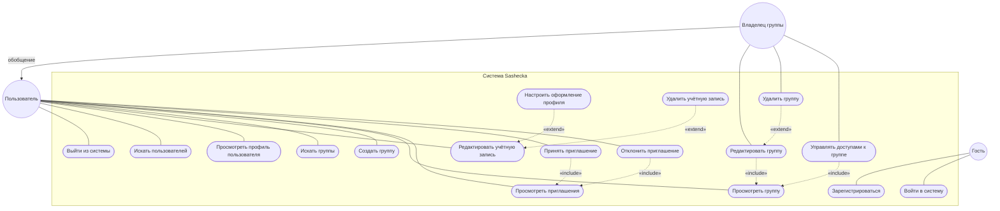
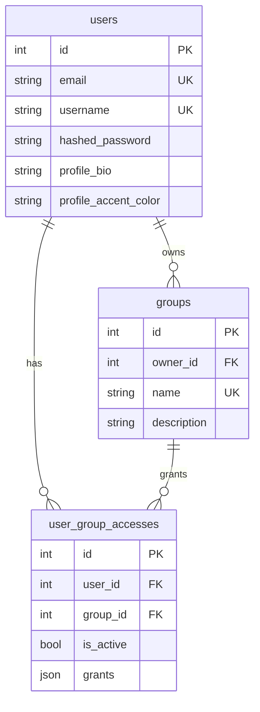

# Sashecka

Учебный MVP веб-приложения для управления пользователями, группами и правами доступа. Проект используется при прохождении учебных практик **УП.02 (ПМ02)** и **УП.11 (ПМ11)** по специальности 09.02.07 «Информационные системы и программирование».

## Общие сведения

| Поле | Значение |
|------|----------|
| **Обучающийся** | Иванов Кирилл Алексеевич |
| **Группа** | 06-23.ИСИП.ОФ-9 |
| **Курс** | 3 |
| **Место практики** | АНПОО «Хекслет колледж» |
| **УП.02 / ПМ02** | Осуществление интеграции программных модулей (04.05.2026 – 17.05.2026) |
| **УП.11 / ПМ11** | Разработка, администрирование и защита баз данных (18.05.2026 – 24.05.2026) |

## Цель и назначение

**Sashecka** — fullstack-приложение с REST API и клиентом на микрофронтендах. Система обеспечивает:

- регистрацию и аутентификацию пользователей (JWT);
- управление профилем;
- создание групп и выдачу прав (`grants`);
- приглашения в группы и их принятие.

Документ `README.md` является **проектной и технической документацией** для анализа взаимодействия компонентов (ПМ02) и проектирования БД (ПМ11). Детали production-развёртывания — в [docs/production-vps.md](docs/production-vps.md).

## Предметная область

| Сущность | Описание |
|----------|----------|
| **User** | Учётная запись: email, username, профиль, хеш пароля |
| **Group** | Группа с владельцем (`owner_id`), названием и описанием |
| **UserGroupAccess** | Связь пользователь–группа: набор `grants`, статус приглашения (`is_active`) |

Бизнес-процессы: регистрация → вход → поиск пользователей → настройки профиля → создание/редактирование групп → приглашения и принятие доступа.

## Диаграмма вариантов использования

Модель построена по правилам UML из [статьи на Habr](https://habr.com/ru/articles/566218/): акторы в единственном числе, варианты использования — в форме глагола, связи подписаны стереотипами.

### Акторы

| Актор | Описание |
|-------|----------|
| **Гость** | Неаутентифицированный посетитель |
| **Пользователь** | Аутентифицированный пользователь (JWT) |
| **Владелец группы** | Пользователь — создатель группы (`owner_id`); наследует возможности **Пользователя** |

### Иерархия акторов (обобщение)

На основной диаграмме ниже обобщение показано **подписанной стрелкой** `обобщение` (в `flowchart` треугольник UML часто не рисуется). Каноничная нотация UML — на отдельной схеме:

```mermaid
classDiagram
  direction TB
  class "Пользователь" as User
  class "Владелец группы" as Owner
  User <|-- Owner : обобщение
  note for Owner "Наследует все UC Пользователя + управление своей группой"
```

### Типы связей (легенда)

| Связь | Обозначение на диаграмме | Смысл |
|-------|--------------------------|--------|
| **Ассоциация** | сплошная линия без стрелки | Актор может выполнить вариант использования |
| **Обобщение** | ▷ на схеме акторов; на UC-диаграмме — стрелка с подписью `обобщение` | Частный актор обобщается до общего; стрелка от **Владелец группы** к **Пользователь** |
| **Включение** `«include»` | пунктир со стрелкой | Базовый UC **обязательно** включает составной (стрелка от базового к включаемому) |
| **Расширение** `«extend»` | пунктир со стрелкой | Дополнительный UC **опционально** расширяет базовый (стрелка от расширения к базовому) |



**Пояснения по связям**

- **Ассоциация** — только между акторами и вариантами использования (не между двумя UC и не между акторами).
- **Обобщение**: на схеме выше — UML-стрелка с треугольником (`User <|-- Owner`); на диаграмме вариантов использования — **`Владелец группы` —обобщение→ `Пользователь`**. Владелец наследует все ассоциации пользователя (выход, поиск, профиль, группы, приглашения) и дополнительно связан с редактированием/удалением группы и управлением доступами.
- **«include»** — редактирование/управление доступами невозможны без просмотра группы; принятие и отклонение приглашения требуют их просмотра.
- **«extend»** — кастомизация и удаление учётной записи опционально дополняют редактирование; удаление группы — опциональное расширение редактирования (не каждое сохранение заканчивается удалением).

Вход и регистрация оставлены на диаграмме как ключевой функционал auth-модуля (для Sashecka это не «фоновые» действия).

### Соответствие реализации

| Вариант использования | Экран / API |
|----------------------|-------------|
| Зарегистрироваться, войти | `auth` remote, `POST /auth/register`, `POST /auth/login` |
| Искать пользователей | `/app`, `GET /users?q=` |
| Редактировать учётную запись | `/settings`, `PUT /users/current` |
| Настроить оформление профиля | `/profile`, `profile-vue` remote |
| Создать / просмотреть / редактировать группу | `/groups/:groupId`, `POST/GET/PUT /groups` |
| Просмотреть / принять / отклонить приглашения | `GET/PATCH/DELETE .../group-invitations` |

## Технологический стек

### Backend

- Python 3.12, `uv`, FastAPI, SQLAlchemy 2.0, Pydantic v2
- SQLite (локальная разработка), PostgreSQL 16 (production)
- PyJWT, `pwdlib[argon2]`, Uvicorn

### Frontend

- React, Vue, Vite, TypeScript, Module Federation
- Mantine, PrimeVue, React Router, TanStack Query

### Инфраструктура

- Docker Compose (dev и production)
- Nginx reverse proxy (production)

## Структура репозитория

```text
sashecka/
├── backend/                 # FastAPI, ORM, миграции
│   └── app/
│       ├── api/routes/      # auth, users, groups
│       ├── models/          # User, Group, UserGroupAccess
│       ├── schemas/
│       ├── core/            # config, security
│       └── db/              # session, migrate.py
├── frontend/
│   ├── apps/
│   │   ├── shell/           # host: routing, guards, layout
│   │   ├── auth/            # remote: login, register
│   │   ├── react-app/       # remote: home, settings, group
│   │   └── profile-vue/     # remote: профиль (Vue)
│   └── packages/
│       ├── api-client/
│       ├── auth-session/
│       ├── design-tokens/
│       └── shared-ui/
├── deploy/nginx/            # production proxy
├── compose.yaml             # dev stack
├── compose.prod.yaml        # production stack
└── docs/
    └── production-vps.md
```

## Архитектура и программные модули (ПМ02, ПК 2.1)

```text
┌───────────────────────────────────────────────────────────────────┐
│  Браузер                                                          │
│  ┌──────────────┐  ┌─────────────┐  ┌──────────────────────────┐  │
│  │ shell        │  │ remotes     │  │ packages                 │  │
│  │ React host   │◄─┤ auth        │  │ api-client, auth-session │  │
│  │              │  │ react-app   │  │ design-tokens, shared-ui │  │
│  │              │  │ profile-vue │  │                          │  │
│  └──────┬───────┘  └─────────────┘  └─────────────┬────────────┘  │
│         │    Module Federation                    │ HTTP /api/v1  │
└─────────┼─────────────────────────────────────────┼───────────────┘
          │                                         ▼
          │                              ┌──────────────────────┐
          │                              │ FastAPI backend      │
          │                              └──────────┬───────────┘
          │                                         ▼
          │                              ┌──────────────────────┐
          └──────────────────────────────┤ SQLite / PostgreSQL  │
                                         └──────────────────────┘
```

### Backend: границы ответственности

| Модуль | Путь | Назначение |
|--------|------|------------|
| Точка входа | `app/main.py` | FastAPI, middleware, health |
| API | `app/api/router.py` | Префикс `/api/v1` |
| Auth | `app/api/routes/auth.py` | Регистрация, логин, JWT |
| Users | `app/api/routes/users.py` | Профиль, поиск, приглашения |
| Groups | `app/api/routes/groups.py` | CRUD групп и доступов |
| ORM | `app/models/` | `User`, `Group`, `UserGroupAccess` |
| Безопасность | `app/core/security.py` | Argon2, JWT encode/decode |
| Зависимости | `app/deps.py` | `get_db`, `get_current_user` |

Контракт API: OpenAPI — `/docs`, `/redoc`. Авторизация: `Authorization: Bearer <token>`.

### Frontend: границы ответственности

| Модуль | Назначение |
|--------|------------|
| `shell` | Маршрутизация, layout, route guards, lazy-load remotes |
| `auth` | Страницы login/register |
| `react-app` | Home, settings, страница группы |
| `profile-vue` | Кастомизация профиля (Vue remote) |
| `@sashecka/api-client` | Единый HTTP-клиент к `/api/v1` |
| `@sashecka/auth-session` | JWT и пользователь в `localStorage` |

## Интеграция модулей (ПМ02, ПК 2.2)

### Module Federation

- Host: `frontend/apps/shell` объявляет remotes `authRemote`, `reactAppRemote`, `profileVueRemote` (`remoteEntry.js`).
- Remotes экспортируют страницы/виджеты через `exposes` в `vite.config.ts`.
- Общие зависимости (`react`, `react-dom`, `react-router-dom`, Mantine, TanStack Query) — `singleton: true`.

### Интеграция с API

- `@sashecka/api-client` добавляет Bearer-токен, обрабатывает 401.
- В dev shell проксирует `/api` на backend (`VITE_BACKEND_ORIGIN`).
- В production один origin: shell, remotes (`/remotes/*`) и API (`/api/v1`) за Nginx — см. [docs/production-vps.md](docs/production-vps.md).

### Поток аутентификации

```text
POST /api/v1/auth/login → access_token + user
        → saveAuthSession (localStorage)
        → запросы с Authorization: Bearer
        → get_current_user в защищённых роутерах
```

## База данных (ПМ11)

### Логическая модель (ER)



### Таблицы и ограничения

| Таблица | Ключевые ограничения |
|---------|----------------------|
| `users` | UNIQUE `email`, UNIQUE `username`; пароль только как `hashed_password` |
| `groups` | UNIQUE `name`; FK `owner_id` → `users.id` |
| `user_group_accesses` | UNIQUE (`user_id`, `group_id`); `user_id` может быть `NULL` (шаблон для всех) |

ORM-модели: `backend/app/models/`. Создание схемы: `python -m app.db.migrate` (`app/db/migrate.py` — `create_all` + `ALTER` для полей профиля).

### СУБД по режимам

| Режим | СУБД | Подключение |
|-------|------|-------------|
| Локально / `compose.yaml` | SQLite | `sqlite:///./app.db` |
| Production | PostgreSQL 16 | `postgresql+psycopg://...` (см. `compose.prod.yaml`) |

### Администрирование и защита (ПМ11, ПК 11.5–11.6)

- PostgreSQL только во внутренней Docker-сети; порт 5432 не публикуется.
- Пароли приложения: Argon2; в API не возвращается `hashed_password`.
- Канал браузер ↔ API: HTTPS (TLS на Nginx в production).
- Резервное копирование: `pg_dump` — примеры в [docs/production-vps.md](docs/production-vps.md).
- Целостность: FK, UNIQUE, транзакции SQLAlchemy, `pool_pre_ping`.

## REST API (краткий перечень)

Префикс: `/api/v1`.

| Метод | Путь | Описание |
|-------|------|----------|
| POST | `/auth/register` | Регистрация |
| POST | `/auth/login` | Логин (OAuth2 form), выдача JWT |
| GET/PUT/DELETE | `/users/current` | Текущий пользователь |
| GET | `/users`, `/users/{id}` | Список (поиск `q`) / пользователь по id |
| GET/PATCH/DELETE | `/users/current/group-invitations/...` | Приглашения в группы |
| GET/POST | `/groups` | Список (поиск `q`) / создание |
| GET/PUT/DELETE | `/groups/{id}` | Группа по id |

Полная спецификация: Swagger UI после запуска backend — `/docs`.

## Установка и запуск

### Требования

- Python 3.12, [uv](https://docs.astral.sh/uv/)
- Node.js 20+ и npm
- Docker и Docker Compose (опционально)

### Backend (локально)

```bash
cd backend
uv python install 3.12
uv lock && uv sync
uv run python -m app.db.migrate
uv run uvicorn app.main:app --reload
```

- Swagger: http://localhost:8000/docs
- ReDoc: http://localhost:8000/redoc

Конфигурация: `backend/.env` (шаблон — `backend/.env.example`).

### Frontend (локально)

```bash
cd frontend
npm ci
npm run dev
```

| Сервис | URL |
|--------|-----|
| Shell | http://localhost:4173 |
| auth remote | http://localhost:4174/remoteEntry.js |
| react-app remote | http://localhost:4175/remoteEntry.js |
| profile-vue remote | http://localhost:4176/remoteEntry.js |

Переменные: `frontend/.env.example` (`VITE_API_BASE_URL`, `VITE_*_REMOTE_URL` и др.).

### Docker Compose (dev)

```bash
docker compose up -d --build
```

| Сервис | URL |
|--------|-----|
| Сайт | http://localhost:4183 |
| Swagger | http://localhost:8001/docs |

Порты `4183` и `8001` выбраны, чтобы не конфликтовать с локальным запуском на `4173` и `8000`.

```bash
docker compose logs -f
docker compose down
```

### Production

```bash
docker compose -f compose.prod.yaml build
docker compose -f compose.prod.yaml up -d
```

Подробный runbook: [docs/production-vps.md](docs/production-vps.md).

## Отладка и тестирование (ПМ02, ПК 2.3–2.4)

### Инструменты отладки

| Инструмент | Применение |
|------------|------------|
| Chrome DevTools | `remoteEntry.js`, ответы API, 401/422 |
| Swagger `/docs` | Проверка контрактов без UI |
| `docker compose logs -f` | Логи backend и frontend |
| `RemoteErrorBoundary` | Изоляция падения remote |

### Типичные проблемы

| Симптом | Решение |
|---------|---------|
| `no such column: groups.owner_id` | Удалить устаревшую `backend/app.db`, перезапустить backend |
| 401 на login | Неверный email/username или пароль |
| Remote не грузится | Проверить `VITE_*_REMOTE_URL` и доступность `remoteEntry.js` |
| CORS в dev | Ходить в API через proxy shell, не напрямую на `:8000` |

### Smoke-сценарий

1. Регистрация → вход
2. Home: поиск пользователей
3. Settings: обновление профиля
4. Profile (Vue remote)
5. Создание и редактирование группы, приглашения

### CI

`.github/workflows/ci.yml`: сборка remotes и shell, `compileall` backend, `tsc --noEmit`, проверка `compose.prod.yaml config`.

Автоматических unit-тестов в репозитории нет; верификация — CI + ручные сценарии выше.

## Стандарты кодирования (ПМ02, ПК 2.5)

| Область | Соглашение |
|---------|------------|
| Python | PEP 8, type hints, SQLAlchemy 2 `Mapped[]` |
| API | Pydantic v2, осмысленные HTTP-коды |
| TypeScript | Типы DTO в `api-client`, workspace `@sashecka/*` |
| Секреты | Только через env; `.env.example` в репозитории |
| Git | Проверка сборки на PR в `main` |

Архитектурные паттерны: слоистый backend (routes → schemas → models); microfrontends + shared kernel на frontend; единый reverse proxy в production.

## Выполнение заданий учебной практики

### УП.02 / ПМ02 — интеграция программных модулей

| № | Задание | Где реализовано |
|---|---------|-----------------|
| 1 | Требования к модулям по проектной и технической документации | Разделы «Архитектура», «REST API», этот README |
| 2 | Интеграция модулей в ПО | Module Federation, `api-client`, Docker/Nginx |
| 3 | Отладка специализированными средствами | DevTools, Swagger, compose logs (см. выше) |
| 4 | Тестовые наборы и сценарии | CI, smoke-сценарий, health-checks |
| 5 | Инспектирование по стандартам кодирования | Раздел «Стандарты кодирования», CI |

### УП.11 / ПМ11 — базы данных

| № | Задание | Где реализовано |
|---|---------|-----------------|
| 1 | Сбор и анализ информации для проектирования БД | «Предметная область», ER-диаграмма, модели ORM |
| 2 | Проектирование БД | Таблицы, связи, ограничения (раздел «База данных») |
| 3 | Разработка объектов БД | `app/models/`, миграции `app/db/migrate.py` |
| 4 | Реализация в СУБД | SQLite (dev), PostgreSQL 16 (production) |
| 5 | Администрирование БД | `compose.prod.yaml`, healthcheck, `pg_dump` |
| 6 | Защита информации в БД | Argon2, JWT, TLS, внутренняя сеть Docker |

## Дополнительная документация

- [docs/production-vps.md](docs/production-vps.md) — production на VPS
- [FastAPI Security (JWT)](https://fastapi.tiangolo.com/tutorial/security/oauth2-jwt/)
- [SQLAlchemy ORM Quick Start](https://docs.sqlalchemy.org/en/stable/orm/quickstart.html)
- [Module Federation for Vite](https://module-federation.io/)
